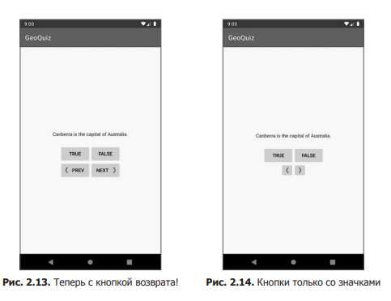
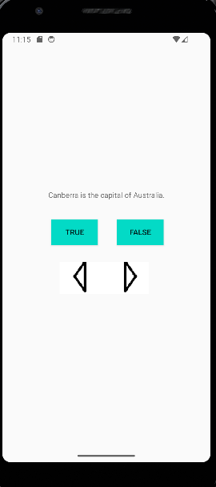

<h1 align="center" paddin> МИНИСТЕРСТВО НАУКИ И ВЫСШЕГО ОБРАЗОВАНИЯ РОССИЙСКОЙ ФЕДЕРАЦИИ ФЕДЕРАЛЬНОЕ ГОСУДАРСТВЕННОЕ БЮДЖЕТНОЕ ОБРАЗОВАТЕЛЬНОЕ УЧРЕЖДЕНИЕ ВЫСШЕГО ОБРАЗОВАНИЯ «САХАЛИНСКИЙ ГОСУДАРСТВЕННЫЙ УНИВЕРСИТЕТ»</h1>

<p align="center"><strong>Лабораторная работа №2 "Android и модель MVC" </strong></p>

<p align="right">Выполнил: Рогаль С. А.</p>
<p align="right">Проверил: Соболев Е. И.</p>

<p align="center">г. Южно-Сахалинск <br> 2024 год</p>

<h2 align="center">Введение</h2>
<p align="justify">MVC — это шаблон программирования, который позволяет разделить логику приложения на три части: Model (модель). Получает данные от контроллера, выполняет необходимые операции и передаёт их в вид. View (вид или представление). Получает данные от модели и выводит их для пользователя. Controller (контроллер). Обрабатывает действия пользователя, проверяет полученные данные и передаёт их модели. 
</p>

<h2 align="center">Цели и задачи</h2>
<ol>
  <li>Добавление слушателя для TextView 
Кнопка NEXT удобна, но было бы неплохо, если бы пользователь мог переходить к следующему вопросу простым нажатием на виджет TextView. 
Подсказка. Для TextView можно использовать слушателя View.OnClickListener, который использовался с Button, потому что класс TextView также является производным от View.</li>
   <li>Добавление кнопки возврата
Добавьте кнопку для возвращения к предыдущему вопросу. Пользовательский интерфейс должен выглядеть примерно так, как показано на рис. 2.13. .</li>
  <li>От Button к ImageButton 
Возможно, пользовательский интерфейс будет смотреться еще лучше, если на кнопках будут отображаться только значки, как на рис. 2.14.
Для этого оба виджета должны относиться к типу ImageButton (вместо обычного Button). Виджет ImageButton является производным от ImageView, в отличие от виджета Button, производного от TextView. Диаграммы их наследования изображены на рис. 2.15. Атрибуты text и drawable кнопки NEXT можно заменить одним атрибутом ImageView.</li>
</ol>
<p>Конечно, вам также придется внести изменения в MainActivity, чтобы этот класс работал с ImageButton. После того как вы замените эти кнопки на кнопки ImageButton, Android Studio выдаст предупреждение об отсутствии атрибута android:contentDescription. Этот атрибут обеспечивает доступность контента для читателей с ослабленным зрением. Строка, заданная этому атрибуту, читается экранным диктором (при включении соответствующих настроек в системе пользователя). Наконец, добавьте атрибут android:contentDescription в каждый элемент ImageButton.</p>


<h2>Решение задач</h2>
<p>1. Определяем событие клика на TextView</p>

  ```java
  questionTextView.setOnClickListener {
            currentIndex = (currentIndex + 1) % questionBank.size
            val questionTexResId = questionBank[currentIndex].textResId
            questionTextView.setText(questionTexResId)
}
```

<p>2. Создаем кнопку переключения назад prevButton и указываем обработчик клика</p>

  ```java
prevButton.setOnClickListener{
            if(currentIndex==0){
                currentIndex = questionBank.size
            }
            currentIndex = (currentIndex - 1) % questionBank.size
            val questionTexResId = questionBank[currentIndex].textResId
            questionTextView.setText(questionTexResId)
}
```

<p>3. Создаем 2 кнопки типа ImageButton: переключение вперед и назад</p>

  ```xml
<ImageButton
        android:id="@+id/next_button"
        android:layout_width="89dp"
        android:layout_height="60dp"
        android:layout_marginEnd="116dp"
        android:layout_marginBottom="292dp"
        android:background="@color/white"
        android:contentDescription="@string/next_button"
        android:src="@drawable/arrow_right"
        app:layout_constraintBottom_toBottomOf="parent"
        app:layout_constraintEnd_toEndOf="parent" />

    <ImageButton
        android:id="@+id/prev_button"
        android:layout_width="95dp"
        android:layout_height="60dp"
        android:layout_marginStart="108dp"
        android:layout_marginBottom="292dp"
        android:background="@color/white"
        android:contentDescription="@string/prev_button"
        android:src="@drawable/arrow_left"
        app:layout_constraintBottom_toBottomOf="parent"
        app:layout_constraintStart_toStartOf="parent" 
/>
```

<h2 align="center">Вывод</h2>
<p align="justify">Таким образом, я начал первый проект в Android Studio - GeoQuiz, создал небольшой пользовательский интерфейс, механизм переключения вопросов и проверки ответов. </p>


