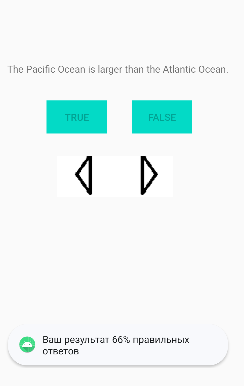

<h1 align="center" paddin> МИНИСТЕРСТВО НАУКИ И ВЫСШЕГО ОБРАЗОВАНИЯ РОССИЙСКОЙ ФЕДЕРАЦИИ ФЕДЕРАЛЬНОЕ ГОСУДАРСТВЕННОЕ БЮДЖЕТНОЕ ОБРАЗОВАТЕЛЬНОЕ УЧРЕЖДЕНИЕ ВЫСШЕГО ОБРАЗОВАНИЯ «САХАЛИНСКИЙ ГОСУДАРСТВЕННЫЙ УНИВЕРСИТЕТ»</h1>

<p align="center"><strong>Лабораторная работа №3 "Жизненный цикл activity" </strong></p>

<p align="right">Выполнил: Рогаль С. А.</p>
<p align="right">Проверил: Соболев Е. И.</p>

<p align="center">г. Южно-Сахалинск <br> 2024 год</p>

<h2 align="center">Введение</h2>
<p align="justify">Ключевым компонентом для создания визуального интерфейса в приложении Android является activity (активность). Нередко activity ассоциируется с отдельным экраном или окном приложения, а переключение между окнами будет происходить как перемещение от одной activity к другой. Приложение может иметь одну или несколько activity.  
<p>Все приложения Android имеют строго определенный системой жизненный цикл. При запуске пользователем приложения система дает этому приложению высокий приоритет. Каждое приложение запускается в виде отдельного процесса, что позволяет системе давать одним процессам более высокой приоритет, в отличие от других. Благодаря этому, например, при работе с одними приложениями Android позволяет не блокировать входящие звонки. После прекращения работы с приложением, система освобождает все связанные ресурсы и переводит приложение в разряд низкоприоритетного и закрывает его.

Все объекты activity, которые есть в приложении, управляются системой в виде стека activity, который называется back stack. При запуске новой activity она помещается поверх стека и выводится на экран устройства, пока не появится новая activity. Когда текущая activity заканчивает свою работу (например, пользователь уходит из приложения), то она удаляется из стека, и возобновляет работу та activity, которая ранее была второй в стеке.

После запуска activity проходит через ряд событий, которые обрабатываются системой и для обработки которых существует ряд обратных вызовов:</p>

```java
protected void onCreate(Bundle saveInstanceState);
protected void onStart();
protected void onRestart();
protected void onResume();
protected void onPause();
protected void onStop();
protected void onDestroy();
```

<h2 align="center">Цели и задачи</h2>
<ol>
  <li>Предотвращение ввода нескольких ответов.
После того как пользователь введет ответ на вопрос, заблокируйте кнопки этого вопроса, чтобы предотвратить возможность ввода нескольких ответов. 
</li>
   <li>Вывод оценки.
После того как пользователь введет ответ на все вопросы, отобразите уведомление с процентом правильных ответов. </li>
</ol>

<h2>Решение задач</h2>
<p>1. Добавляем обработчик нажатий на prevButton и nextButton. Данная функция будет выключать кнопки, если на вопрос уже был дан ответ, и включать их в противном случае</p>

  ```kotlin
fun checkAnsweredQuestion(){
            if (answeredQuestions[currentIndex]==true){
                trueButton.isEnabled = false
                falseButton.isEnabled = false
            }
            else{
                trueButton.isEnabled = true
                falseButton.isEnabled = true
            }
}

```

<p>2. Было написано 2 функции. Первая будет проверять количество верных и неверных ответов на вопросы и выводить статистику, когда будут даны ответы на все вопросы (при нажатии на trueButton или falseButton)</p>

  ```kotlin
fun checkWin(){
            if(correctAnswCount+incorrectAnswCount==questionBank.size){
                val res = 100*correctAnswCount/questionBank.size
                Toast.makeText(this, "Ваш результат "+res.toString()+"% правильных ответов", Toast.LENGTH_SHORT).show()
            }
        }
```

<p>Вторая функция будет проверять ответ на вопрос и увеличивать соответствующий счетчик. (при нажатии на trueButton или falseButton)</p>

  ```kotlin
fun checkAnswer(answer:Boolean){
            if (questionBank[currentIndex].answer==answer){
                Toast.makeText(this, R.string.correct_toast, Toast.LENGTH_SHORT).show()
                correctAnswCount+=1
            }
            else{
                Toast.makeText(this, R.string.incorrect_toast, Toast.LENGTH_SHORT).show()
                incorrectAnswCount+=1
            }
        }
```

<h2 align="center">Вывод</h2>
<p align="justify">Таким образом, я продолжаю развивать первый проект в Android Studio - GeoQuiz. Дополнил механизмы ответов на вопросы и их проверки. В итоге получилась уже минимальная рабочая версия приложения. Приложение изображено на рисунке:</p>



