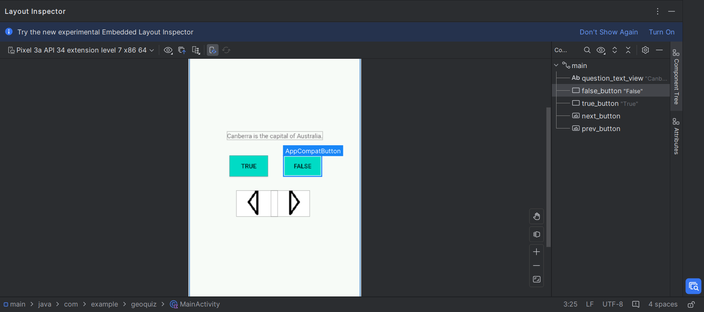
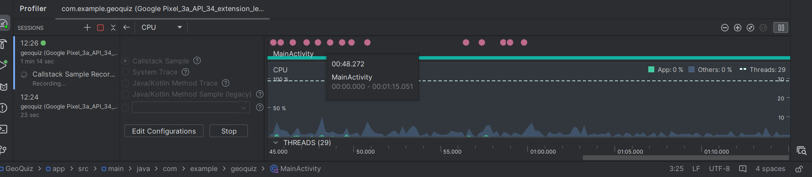
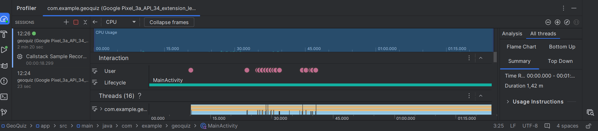

<h1 align="center" paddin> МИНИСТЕРСТВО НАУКИ И ВЫСШЕГО ОБРАЗОВАНИЯ РОССИЙСКОЙ ФЕДЕРАЦИИ ФЕДЕРАЛЬНОЕ ГОСУДАРСТВЕННОЕ БЮДЖЕТНОЕ ОБРАЗОВАТЕЛЬНОЕ УЧРЕЖДЕНИЕ ВЫСШЕГО ОБРАЗОВАНИЯ «САХАЛИНСКИЙ ГОСУДАРСТВЕННЫЙ УНИВЕРСИТЕТ»</h1>

<strong>Лабораторная работа №4 "Отладка Android-приложений" </strong>

Выполнил: Рогаль С. А.

Проверил: Соболев Е. И.

г. Южно-Сахалинск   2024 год

<h2 align="center">Введение</h2>

Отладка – это процесс поиска и исправления ошибок или неполадок в исходном коде какого-либо программного обеспечения.
Когда программное обеспечение не работает, как ожидалось, компьютерные программисты изучают код, чтобы выяснить причину появления ошибок. Они используют инструменты отладки для запуска программного обеспечения в контролируемой среде, пошаговой проверки кода, а также анализа и поиска проблем
<h2 align="center">Цели и задачи</h2>
<ol>
  <li><strong>Упражнение. Исследуем Layout Inspector</strong> 

Для диагностики проблем с файлами макетов и интерактивного анализа визуализации макета на экране можно воспользоваться инструментом Layout Inspector. Убедитесь в том, что GeoQuiz выполняется в эмуляторе, и нажмите кнопку Layout Inspector на левой панели окна Android Monitor. Далее вы сможете исследовать свойства своего макета, щелкая на элементах в представлении Layout Inspector. 

</li>
  <li><strong>Упражнение. Profiler </strong> 

С помощью инструмента Profiler создаются подробные отчеты о том, как ваше приложение использует ресурсы Android-устройства, а именно процессор и память. Это полезно при оценке и настройке производительности вашего приложения. Для просмотра окна Profiler запустите приложение на подключенном Android устройстве или эмуляторе, в строке меню выберите команду View ⇒ Tool Windows ⇒ Profiler. В открывшемся окне Profiler отобразится временная шкала с показаниями по использованию сети, процессора, памяти и заряда аккумулятора. Щелкните по разделу, чтобы увидеть более подробную информацию об использовании этого ресурса вашим приложением. В режиме просмотра процессора нажмите кнопку Record, чтобы получить более подробную информацию об использовании процессора. После выполнения любых взаимодействий с приложением, которые вы хотите записать, нажмите кнопку Stop, чтобы остановить запись. 

</ol>

<h2>Решение задач</h2>

1. Работа с LayoutInspector: 

2. Работа с Profiler: Процесс записи

Результат записи: 

<h2 align="center">Вывод</h2>

Таким образом, я продолжаю изучать Android Studio. Освоил отладку Android приложений, что позволит мне больше контролировать процесс разработки и следить за ошибками или показателями

