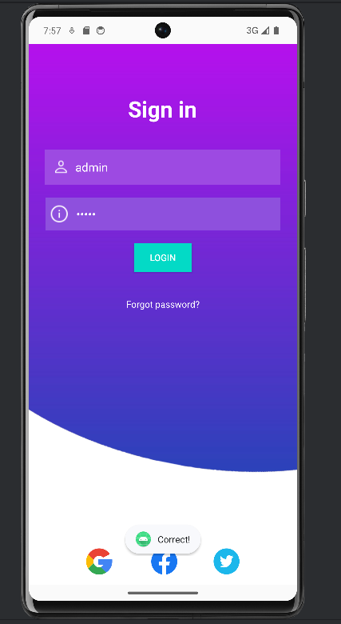

<h1 align="center" paddin> МИНИСТЕРСТВО НАУКИ И ВЫСШЕГО ОБРАЗОВАНИЯ РОССИЙСКОЙ ФЕДЕРАЦИИ ФЕДЕРАЛЬНОЕ ГОСУДАРСТВЕННОЕ БЮДЖЕТНОЕ ОБРАЗОВАТЕЛЬНОЕ УЧРЕЖДЕНИЕ ВЫСШЕГО ОБРАЗОВАНИЯ «САХАЛИНСКИЙ ГОСУДАРСТВЕННЫЙ УНИВЕРСИТЕТ»</h1>

<p align="center"><strong>Лабораторная работа №7 "Макет" </strong></p>

<p align="right">Выполнил: Рогаль С. А.</p>
<p align="right">Проверил: Соболев Е. И.</p>

<p align="center">г. Южно-Сахалинск <br> 2024 год</p>

<h2 align="center">Введение</h2>
<p align="justify">Макет Android – это объект, который определяет визуальную структуру пользовательского интерфейса. То, как будет выглядеть утилита на дисплее задействованного устройства. Компоненты пользовательского интерфейса будут определяться в пределах выбранного макета относительно других элементов. К таковым составляющим относятся:
<ul>
  <li>тестовые поля;</li>
  <li>кнопки;</li>
  <li>маркеры;</li>
  <li>указатели;</li>
  <li>иные составляющие интерфейса.</li>
</ul>
Пользовательский интерфейс в Android может быть создан через XML-файлы, а также посредством Java-кода.<br>
Первый вариант более удобен – в нем представление контента будет храниться обособлено от итоговой кодификации управления поведением. За счет этого отладка и корректировка элементов на дисплее Android контента станет проще и безопаснее. XML-документы макетов размещаются в папке res/layout.</p>
<h2 align="center">Цели и задачи</h2>
<p><strong>Упражнение. Сделать функциональный макет</strong></p>
<p>Необходимо реализовать макет по изображению использую материалы из архива lab7.zip, соблюдая отступы согласно рисунку 1. Реализовать простую авторизацию по логину паролю, при удачной попытке вывести пользователю сообщение об авторизации, если пароль логин неверный, то сообщение об ошибке. </p>


<h2>Решение задач</h2>
<p>Реазовали макет посредством разметки XML, код и его результат приведены ниже</p>

```xml
<?xml version="1.0" encoding="utf-8"?>
<androidx.constraintlayout.widget.ConstraintLayout xmlns:android="http://schemas.android.com/apk/res/android"
    xmlns:app="http://schemas.android.com/apk/res-auto"
    xmlns:tools="http://schemas.android.com/tools"
    android:id="@+id/main"
    android:layout_width="match_parent"
    android:layout_height="match_parent"
    tools:context=".MainActivity">

    <ImageView
        android:id="@+id/background"
        android:layout_width="match_parent"
        android:layout_height="match_parent"
        android:background="#3ADDCA"
        android:clickable="false"
        app:srcCompat="@drawable/background"
        tools:ignore="ContentDescription"
        android:scaleType="centerCrop"/>

    <TextView
        android:layout_width="wrap_content"
        android:layout_height="wrap_content"
        android:autoText="false"
        android:text="or sign in with"
        android:textColor="#A19E9E"
        app:layout_constraintBottom_toTopOf="@+id/facebook_icon"
        app:layout_constraintEnd_toEndOf="parent"
        app:layout_constraintStart_toStartOf="parent"
        app:layout_constraintTop_toTopOf="parent"
        app:layout_constraintVertical_bias="0.978" />

    <ImageView
        android:id="@+id/google_icon"
        android:layout_width="40dp"
        android:layout_height="40dp"
        android:layout_marginStart="88dp"
        android:layout_marginBottom="16dp"
        app:layout_constraintBottom_toBottomOf="parent"
        app:layout_constraintStart_toStartOf="parent"
        app:srcCompat="@drawable/google"
        tools:ignore="MissingConstraints" />

    <ImageView
        android:id="@+id/facebook_icon"
        android:layout_width="40dp"
        android:layout_height="40dp"
        android:layout_marginStart="48dp"
        android:layout_marginBottom="16dp"
        app:layout_constraintBottom_toBottomOf="@+id/background"
        app:layout_constraintEnd_toStartOf="@+id/imageView4"
        app:layout_constraintHorizontal_bias="0.173"
        app:layout_constraintStart_toEndOf="@+id/google_icon"
        app:srcCompat="@drawable/fb"
        tools:ignore="MissingConstraints" />

    <ImageView
        android:id="@+id/imageView4"
        android:layout_width="40dp"
        android:layout_height="40dp"
        android:layout_marginEnd="88dp"
        android:layout_marginBottom="16dp"
        app:layout_constraintBottom_toBottomOf="parent"
        app:layout_constraintEnd_toEndOf="parent"
        app:srcCompat="@drawable/twitter" />

    <TextView
        android:id="@+id/textView"
        android:layout_width="wrap_content"
        android:layout_height="wrap_content"
        android:textStyle="bold"
        android:layout_marginTop="76dp"
        android:text="Sign in"
        android:textColor="@color/white"
        android:textSize="34sp"
        app:layout_constraintEnd_toEndOf="parent"
        app:layout_constraintHorizontal_bias="0.498"
        app:layout_constraintStart_toStartOf="parent"
        app:layout_constraintTop_toTopOf="@+id/background" />

    <EditText
        android:id="@+id/passwordEditText"
        style="@style/Widget.AppCompat.EditText"
        android:layout_width="360dp"
        android:layout_height="50dp"
        android:layout_marginTop="20dp"
        android:background="#F3EDED"
        android:backgroundTint="#8E50DD"
        android:drawableStart="@drawable/icon_info"
        android:drawablePadding="10dp"
        android:drawableTint="@color/white"
        android:ems="10"
        android:hint="Password"
        android:inputType="textPassword"
        android:paddingStart="5dp"
        android:textColor="@color/white"
        android:textColorHint="@color/white"
        app:layout_constraintEnd_toEndOf="parent"
        app:layout_constraintStart_toStartOf="parent"
        app:layout_constraintTop_toBottomOf="@+id/usernameEditText" />

    <EditText
        android:id="@+id/usernameEditText"
        android:layout_width="361dp"
        android:layout_height="53dp"
        android:layout_marginTop="40dp"
        android:background="#9D4AE2"
        android:drawableStart="@drawable/icon_user"
        android:drawablePadding="10dp"
        android:drawableTint="@color/white"
        android:ems="10"
        android:hint="Username"
        android:inputType="text"
        android:paddingStart="13dp"
        android:textColor="@color/white"
        android:textColorHint="@color/white"
        app:layout_constraintEnd_toEndOf="parent"
        app:layout_constraintHorizontal_bias="0.481"
        app:layout_constraintStart_toStartOf="parent"
        app:layout_constraintTop_toBottomOf="@+id/textView" />

    <Button
        android:id="@+id/login_button"
        style="@style/Widget.AppCompat.Button.Colored"
        android:layout_width="89dp"
        android:layout_height="43dp"
        android:layout_marginTop="20dp"
        android:background="@color/design_default_color_secondary"
        android:backgroundTint="@color/design_default_color_secondary"
        android:text="Login"
        android:textColor="@color/white"
        app:layout_constraintEnd_toEndOf="parent"
        app:layout_constraintStart_toStartOf="parent"
        app:layout_constraintTop_toBottomOf="@+id/passwordEditText" />

    <TextView
        android:id="@+id/textView2"
        android:layout_width="wrap_content"
        android:layout_height="wrap_content"
        android:layout_marginTop="40dp"
        android:text="Forgot password?"
        android:textColor="@color/white"
        app:layout_constraintEnd_toEndOf="parent"
        app:layout_constraintStart_toStartOf="parent"
        app:layout_constraintTop_toBottomOf="@+id/login_button" />


</androidx.constraintlayout.widget.ConstraintLayout>
```

<p>На заметку: для изменения фона компонента нужно в файле themes.xml (и в night) в папке res/values/themes изменить строчку, а точнее атрибут parent на такой:</p>

```xml
<style name="Base.Theme.Lab7maket" parent="Theme.AppCompat.Light.NoActionBar">
```




<p>Реализована авторизация:</p>

```kotlin
class MainActivity : AppCompatActivity() {

    private lateinit var loginButton: Button
    private lateinit var usernameEditText: EditText
    private lateinit var passwordEditText: EditText

    override fun onCreate(savedInstanceState: Bundle?) {
        ...
        loginButton = findViewById(R.id.login_button)
        usernameEditText = findViewById(R.id.usernameEditText)
        passwordEditText = findViewById(R.id.passwordEditText)

        loginButton.setOnClickListener {
            val username: String = usernameEditText.getText().toString()
            val password: String = passwordEditText.getText().toString()
            if (username=="admin" && password=="admin"){
                Toast.makeText(this, R.string.correct_login_toast, Toast.LENGTH_SHORT).show()
            }
            else Toast.makeText(this, R.string.incorrect_login_toast, Toast.LENGTH_SHORT).show()
        }
    }
}
```

</ul>
<h2 align="center">Вывод</h2>
<p align="justify">Таким образом, я продолжаю изучать Android Studio в направлении пользовательского интерфейса. Коснулся темы разметки XML и различных атрибутов компонентов, таких как TextView, EditText, ImageView и других.</p>


